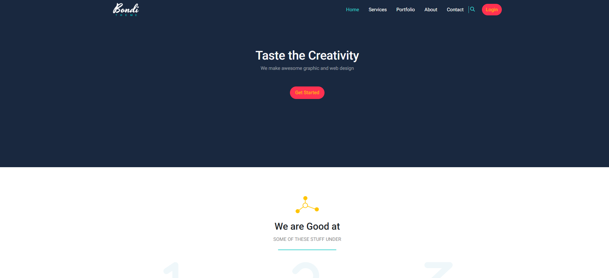
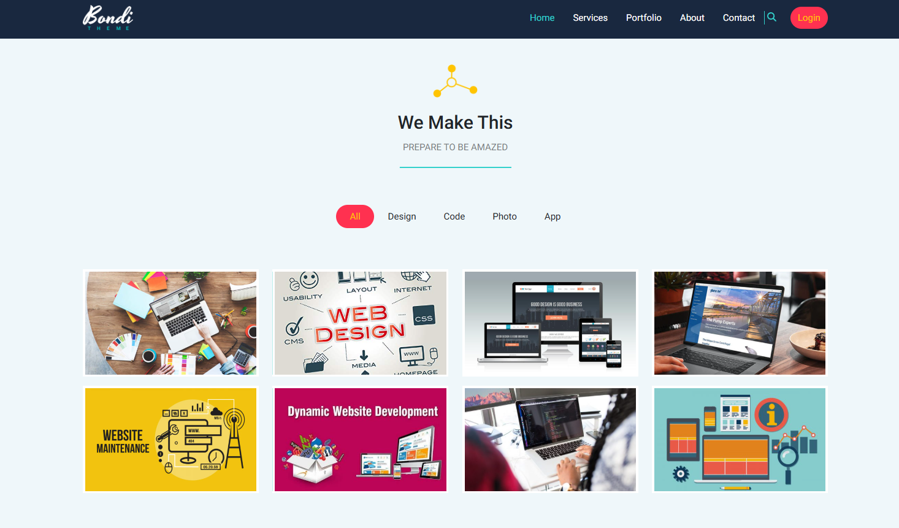

# 🌐 Bondi Design Portfolio

 A responsive, modern portfolio site built using **Bootstrap 5**

 

## 📌 Overview

This project is a personal portfolio website based on the **Bondi Design template**, customized and enhanced using **Bootstrap**. It showcases my front-end development skills and demonstrates mastery of Bootstrap’s grid system, responsive utilities, and components.

The site is fully responsive, visually appealing, and mobile-first — designed to present my work in a clean, professional layout.

---

## 🚀 Live Demo

🔗 [View Live Site](https://khezamitaha.github.io/Bootstrap_5_Design_01_Bondi/)

---

## 🎯 Objectives

- Build a visually consistent, fully responsive site with **Bootstrap**
- Customize and extend a Bootstrap-based template (Bondi)
- Implement reusable components and layout systems
- Optimize for accessibility and performance

---

## 🛠️ Technologies Used

- **HTML5**
- **Bootstrap 5**
- **CSS3**
- Font Awesome (Icons)
- Google Fonts

---

## 📁 Project Structure

/project-root  
├── index.html  
├── about.html  
├── contact.html  
├── css/  
└──   └── style.css (custom overrides)  
├── js/  
└──   └── script.js (if used)  
├── assets/  
└──   └── images/ (portfolio and UI assets)  
└── README.md

---

## 💡 Bootstrap Features Demonstrated

✅ **Grid System**  
Responsive layout using `container`, `row`, and `col-*` classes for adaptive sections.

✅ **Navbar**  
Sticky responsive navbar with brand, navigation links, and collapsible menu using Bootstrap’s `navbar-toggler`.

✅ **Cards & Components**  
Used cards to showcase portfolio items and team members with consistent UI.

✅ **Utility Classes**  
Made heavy use of spacing (`p-*`, `m-*`), color (`bg-*`, `text-*`), and flex utilities.

✅ **Forms & Buttons**  
Clean, styled contact form using Bootstrap’s form controls and responsive buttons.

✅ **Carousel / Testimonials** *(if applicable)*  
Implemented carousel slider to showcase client testimonials or featured work.

✅ **Responsive Images & Media**  
Ensured all images use `.img-fluid` for adaptability.

---

## 📱 Responsive Design

- **Mobile-first** layout
- Media queries via Bootstrap’s built-in breakpoints
- Adaptive spacing, font sizes, and components

Tested on:
- Mobile (iOS & Android)
- Tablet
- Desktop (Chrome, Firefox, Edge)

---

## 📸 Screenshots

 

---

## 👤 Author

**Your Name**  
Front-End Developer | Responsive Web Design | Bootstrap UI Developer  
🔗 [LinkedIn](https://linkedin.com/in/your-profile)  
🔗 [GitHub](https://github.com/KhezamiTaha)

---

## 📌 License

This project is open source and available under the [MIT License](LICENSE).

---

